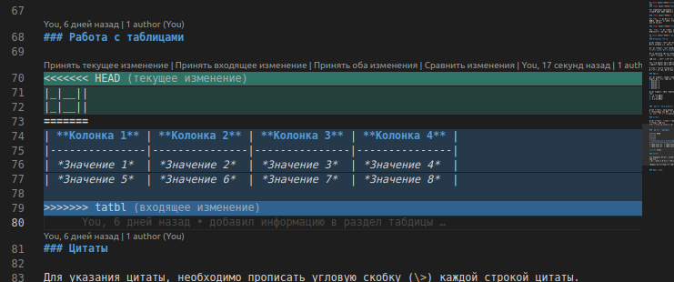

# Инструкция для работы с Markdown

## Что такое GIT?

Git - это одна из реализаций распределенных систем контроля версий имеющая как локальные, так и удаленные репозиториии. Я вляется популярной реализацией систем контроля версий в мире.

## Создание локального репозитория

Для создания репозитория необходимо выполнить команду _git init_ в нужной папке и у нас создастся репозиторий (появится скрытая папка .git) 

## Создание коммитов (сохранений версий)
***
### Git add

Для добавления изменений в коммит используется команда *git add*. Что бы использовать команду *git add* напишите *git add <имя файла>*

### Просмотр состояния репозитория

Для того, что бы посмотреть состояние репозитория исползуется *git status*. Для этого в папке репозитория нужно ввести команду *git status* и Вы увидите были ли изменения в файлах или их не было

### Создание коммитов

Для  того, что бы создать коммит (сохранение) необходимо выполнить команду *git commit*. Выполняется она так: *git commit -m <комментарий (название) сохранения в ковычках ("")>*

## Работа с текстом
---
### Выделение текста

Чтобы выделить текст курсивом, необходимо обромить его звездочками (*) символом нижнее подчеркивание (_). Нпример *вот так* или _вот так_. 

Что бы выделить текст полужирным, необходимо обрамить его двойными звездочками(**) или двойным нижним подчеркиванием (__). Например **вот так** или __вот так__.

Альтернативный способ выделения текста нужен для того, что бы можно было курсив и полужирный шрифты совмещать в одном тексте.

Например, _текст может быть выделен курсивом, но при этом **быть полужирным**_

Для отображения зачеркнутого текста, необходимо обромить его двойной тильдой (\~~). Например ~~gbitv~~ пишем зачеркнутый ~~текст~~

А если в тексте должна быть звездочка или любой другой «специальный» символ, который можно прочесть не так, перед ней надо поставить обратный слэш. Например, вот так: \*.

### Списки

Что бы добавить ненумерованные списки, необходимо пункты списка выделить звездочкой (*) или знаком плюс (+). Например так:
* Элемент 1
* Элемент 2
* Элемент 3
+ Элемент 4
+ Элемент 5

Чтобы добавить нумерованные списки, необходимо пункты списка просто пронумеровать. Например так:
1. Первый пункт
2. Второй пункт
3. Третий пункт

### Работа с изображениями

Чтобы вставить изображение в текст, необходимо написать слкдующую конструкцию \:

### Ссылки

Чтобы вставить ссылки в текст, необходимо написать слкдующую конструкцию \[описание ссылки](ссылка): например
[тут ссылка на Лекцию2, по контролю версий](https://gb.ru/lessons/325763)

### Работа с таблицами

| **Колонка 1** | **Колонка 2** | **Колонка 3** | **Колонка 4** |
|---------------|---------------|---------------|---------------|
| *Значение 1*  | *Значение 2*  | *Значение 3*  | *Значение 4*  |
| *Значение 5*  | *Значение 6*  | *Значение 7*  | *Значение 8*  |

### Цитаты

Для указания цитаты, необходимо прописать угловую скобку (\>) каждой строкой цитаты. Например:
> То, чему мы учимся с удовольствием, мы никогда не забываем.

>Знания не достигаются случайно, их нужно искать с пылом и усердием. 

## Работа с ветками:
***
Для удобства работы на определенным куском текста или частью пректа, можно создать одельную ветку (копию проекта), в которой можно вносить изменения, не боясь, что основной проект (*рабочая версия*) будет испорчен или утерен.
Создать ветку можно с помощью команды **git branch <branch_name>**
С веткой можно выполнять все теже действия что и с основным проектом, для этого переходим в ветку **git checkot branch_name**. После окончания работы в ветке выполняем команду по индексации изменений **git add ...** и создаем коммит **git commit -m "_комментарий-описание изменений_"**

Как только мы выполнили все работы в ветке и готовы добавить все изменения в основной проект нам нужно перейти на ветку основного проекта **git checkot master** а затем сделать слияние веток 
> **Слияние веток делается из ветки, в которую необходимо слить изменения**

Выполняем команду **git merge branch_name**

если в основной ветке есть элементы которые были изменены при работе с новой веткой, то возникнет конфликт и нам нужно будет **самим в ручном режиме** его решить: принять изменения, не принимать изменения или сохранить оба варианта. Например:

